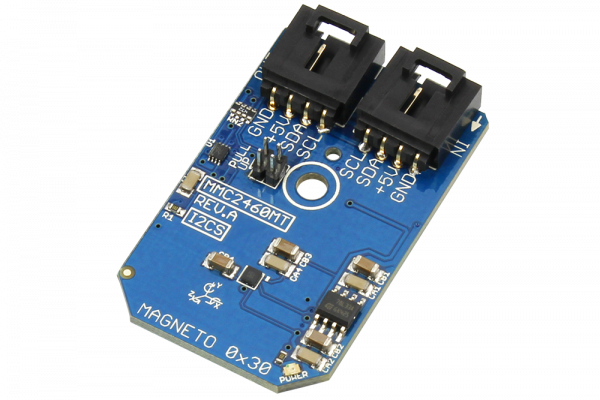

# MMC2460MT

The MMC2460MT is a 2-axis magnetic sensor with on-chip signal processing. The MMC2460MT can measure magnetic fields within the full scale range of ±6 G with an accuracy of 1°. This device communicates via I2C communications at speeds up to 400kHz.
This Device is available from www.ncd.io 

[SKU: MMC2460MT_I2CS]

(https://store.ncd.io/product/mmc2460mt-%C2%B16-gauss-low-noise-2-axis-magnetic-sensor-i2c-mini-module/)
This Sample code can be used with Arduino.

Hardware needed to interface MMC2460MT sensor with Arduino

1. <a href="https://store.ncd.io/product/i2c-shield-for-arduino-nano/">Arduino Nano</a>

2. <a href="https://store.ncd.io/product/i2c-shield-for-arduino-micro-with-i2c-expansion-port/">Arduino Micro</a>

3. <a href="https://store.ncd.io/product/i2c-shield-for-arduino-uno/">Arduino uno</a>

4. <a href="https://store.ncd.io/product/dual-i2c-shield-for-arduino-due-with-modular-communications-interface/">Arduino Due</a>

5. <a href="https://store.ncd.io/product/mmc2460mt-%C2%B16-gauss-low-noise-2-axis-magnetic-sensor-i2c-mini-module/">MMC2460MT 2Axis Magnetic Sensor</a>

6. <a href="https://store.ncd.io/product/i%C2%B2c-cable/">I2C Cable</a>

MMC2460MT:

The MMC2460MT is a 2-axis magnetic sensor with on-chip signal processing. The MMC2460MT can measure magnetic fields within the full scale range of ±6 G with an accuracy of 1°. This device communicates via I2C communications at speeds up to 400kHz.

Applications:

• Electronic Compassing

• GPS Navigation Assist

• Magnetic Field Measurement

How to Use the MMC2460MT Arduino Library

The MMC2460MT has a number of settings, which can be configured based on user requirements.
          
1.Address calling:The following command is used to call the MMC2460MT sensor to begin the transmission.

            mmc.getAddr_MMC2460MT(MMC2460MT_DEFAULT_ADDRESS_MAG);      // 0x30
            
2.Sensor setup:The following command is used to setup the sensor.

             mmc.setUpMagnetometer();
             
3.Output measurement:The following command is used to measure the output of MMC2460MT sensor.             
             
              mmc.Measure_Magnetometer();

